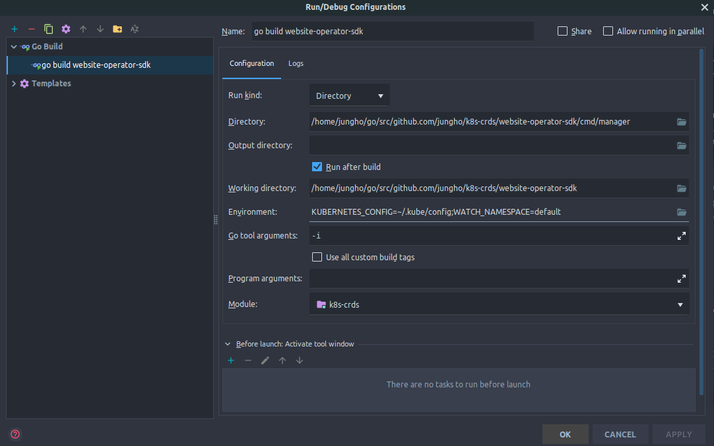
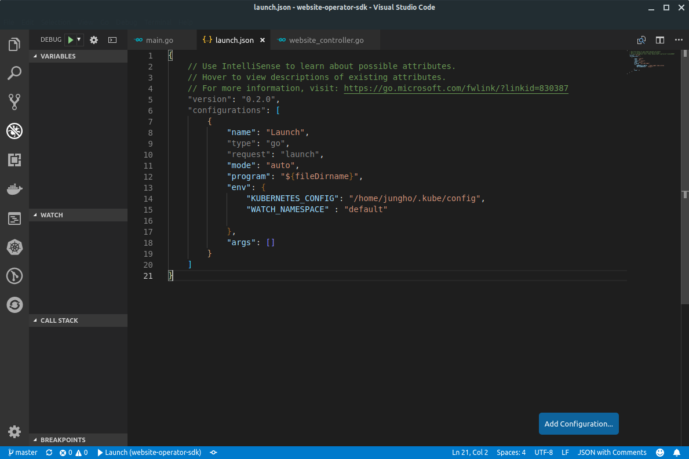

## Creating a new Operator SDK Project

The benefit of Operator SDK is that it generates lot of the scaffolding to make creating CRDs and custom controllers much, much easier.  To create a new Operator SDK project run the following command somewhere within your GOPATH:

```sh
#my GOPATH is ~/go
#I ran this command within ~/go/src/github.com/jungho/k8s-crds
operator-sdk new website-operator-sdk --skip-git-init
```

This will create a directory called `website-operator-sdk` with the following directory structure (note, it won't create the README.md file which I added after I ran the command.):

```sh
[~/go/src/github.com/jungho/website-operator-sdk, master+1]: tree -L 1
.
├── Gopkg.lock
├── Gopkg.toml
├── README.md
├── build
├── cmd
├── deploy
├── pkg
├── vendor
└── version

6 directories, 3 files
```

See [project layout](https://github.com/operator-framework/operator-sdk/blob/master/doc/project_layout.md) for description of each directory.

## Create the scaffolding for the Website CRD and Custom Controller

To add the Website CRD, from the website-controller-sdk directory and run the following command:

```sh
#You MUST run this within the website-controller-sdk project directory.  Otherwise it will fail.  
#This is because the command expects to find the `cmd/manager/main.go` file. 
operator-sdk add api --api-version=example.architech.ca/v1beta1 --kind=Website
```

This will generate some golang code as well as resource yaml files for your CRD.  The yaml files generated in the deploy directory:

```sh
[~/go/src/github.com/jungho/k8s-crds/website-operator-sdk/deploy, master]: tree -L 2
.
├── crds
│   ├── example_v1beta1_website_crd.yaml  # your Website CustomResourceDefinition
│   └── example_v1beta1_website_cr.yaml   # your Website resource
├── operator.yaml # The deployment resource to deploy your operator
├── role_binding.yaml # The RoleBinding that binds your ServiceAccount to the Role 
├── role.yaml # The Role that your ServiceAccount will be bound to.  Has the necessary permissions to access the apiserver.
└── service_account.yaml #The ServiceAccount that the operator will execute as
```

The golang code to represent your Website resource is generated in the pkg/apis/GROUP/VERSION directory.  We will modify the website_types.go file to define your Website resource in golang.

```sh
~/go/src/github.com/jungho/k8s-crds/website-operator-sdk/pkg/apis, master+1]: tree -L 3
.
├── addtoscheme_example_v1beta1.go
├── apis.go
└── example
    └── v1beta1
        ├── doc.go
        ├── register.go
        ├── website_types.go  #You will modify this file so you can consume your Website resource in golang
        └── zz_generated.deepcopy.go

2 directories, 6 files
```

Next, add the controller that will watch and reconcile Website resources.  

```sh
#Make sure you use the SAME api-version and kind as your API!!
operator-sdk add controller --api-version=example.architech.ca/v1beta1 --kind=Website
```

The sdk will generate the code for your controller in the pkg/controller directory.

```sh
[~/go/src/github.com/jungho/k8s-crds/website-operator-sdk/pkg/controller, master+1]: tree -L 2
.
├── add_website.go
├── controller.go
└── website
    └── website_controller.go #You will modify this code to add your reconciliation logic.

1 directory, 3 files
```
## Modifying the generated code to add our reconciliation logic 

First we modify [pkg/apis/example/v1beta1/website_types.go](./pkg/apis/example/v1beta1/website_types.go). This file contains the generated golang struct types for your Website resource. The SDK generates a skeleton, you need to take it the rest of the way.  For our purposes, we want the GitRepo and Replicas fields added the spec and Replicas to the status.

```go
type WebsiteSpec struct {
	// INSERT ADDITIONAL SPEC FIELDS - desired state of cluster
	// Important: Run "operator-sdk generate k8s" to regenerate code after modifying this file
	GitRepo    string `json:"gitRepo,string,omitempty"`
	Replicas   int32  `json:"replicas"`
	Port       int32  `json:"port"`
	TargetPort int32  `json:"targetPort"`
}

// WebsiteStatus defines the observed state of Website
type WebsiteStatus struct {
	// INSERT ADDITIONAL STATUS FIELD - define observed state of cluster
	// Important: Run "operator-sdk generate k8s" to regenerate code after modifying this file
	Replicas int32 `json:"replicas"`
}
```
 Note, as per the comments, whenever you makes changes to this file, you need to run `operator-sdk generate k8s` to update other sdk generated files such as 
[pkg/apis/example/v1beta1/website_types.go](./pkg/apis/example/v1beta1/zz_generated.deepcopy.go).

Next, you need to implement the reconciliation logic by updating [pkg/controller/website/website_controller.go](./pkg/controller/website/website_controller.go).

The key methods are:

```go
// add adds a new Controller to mgr with r as the reconcile.Reconciler
func add(mgr manager.Manager, r reconcile.Reconciler) error 
```
This is the method makes the Manager aware of your controller and is also where you specify which resources
your controller "watches" for changes.  We want to watch for Website, Deployment and Service resources.  Note, we don't
care about all Deployment and Service resources, only those "owned" by Website resources.  
See [pkg/controller/website/website_controller.go](./pkg/controller/website/website_controller.go).

```go
// Reconcile reads the state of the cluster for a Website object and makes changes based on the state read
// and what is in the Website.Spec.  It will create a Deployment and Service if they do not exist.  This is the key
// method that you need to implement after you generate the scaffolding.
//
// The Controller will requeue the Request to be processed again if the returned error is non-nil or
// Result.Requeue is true, otherwise upon completion it will remove the work from the queue.
func (r *ReconcileWebsite) Reconcile(request reconcile.Request) (reconcile.Result, error) 
```

The Reconcile function is part of the [Reconciler](https://github.com/jungho/k8s-crds/blob/master/website-operator-sdk/vendor/sigs.k8s.io/controller-runtime/pkg/reconcile/reconcile.go#L79:6) interface. The generated [ReconcileWebsite struct](https://github.com/jungho/k8s-crds/blob/master/website-operator-sdk/pkg/controller/website/website_controller.go#L83:6) satisfies this interface.  It is responsible for implementing the reconciliation logic and will be invoked for each ADD, UPDATE, DELETE event for our Website resource.  See the [Controller Runtime Client API](https://github.com/operator-framework/operator-sdk/blob/master/doc/user/client.md) for the key interfaces.

## Build and Deploy the operator

You can build and deploy your operator to a cluster or run the operator locally.  I have created a shell script to do this.

1. Update the container image in [deploy/operator.yaml](./deploy/operator.yaml) to be your controller image.
2. Update the image variable in [deploy-operator.sh](./deploy-operator.sh) to be your controller image.

To deploy to the cluster just run `./deploy-operator.sh` without any flags.
To run the operator locally, run `./deploy-operator.sh -l` 

## Debugging the Operator

In Jetbrains Goland IDE, create run/debug configuration and configure like so (Note the Environment Variables!):



In VS Code, create a launch configuration like so:



Then open the main.go file prior to launching the configuration.  See the following docs for more details - https://github.com/Microsoft/vscode-go/wiki/Debugging-Go-code-using-VS-Code.